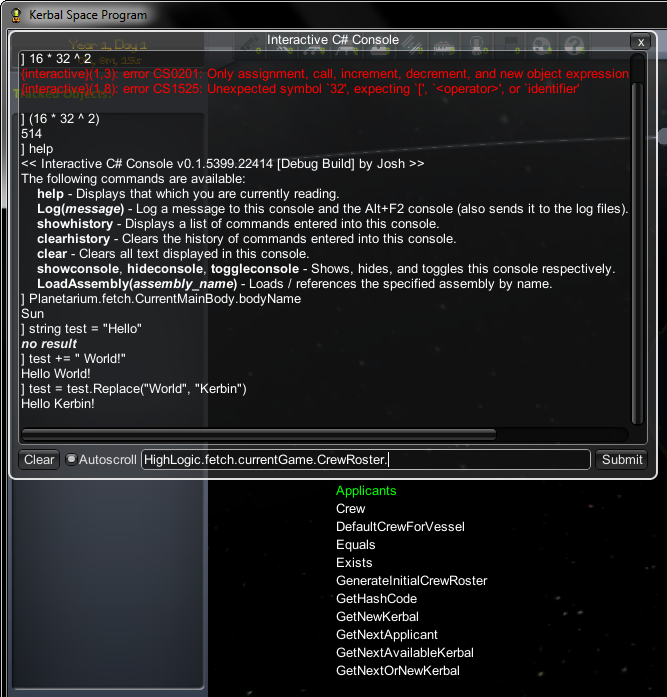

Deprecation Notice:
-----------------
**This plugin is deprecated.** For a better way of debugging your plugins please see this forum thread that describes how you can actually attach the debugger:
http://forum.kerbalspaceprogram.com/threads/114241-KSP-Plugin-debugging-for-Visual-Studio-and-Monodevelop-on-all-OS

This project may be repurposed for something similar in the future, perhaps a generic Unity game console.

Interactive C# Console (CSharpConsole)
=================

CSharpConsole is a plugin for Kerbal Space Program that creates a console in which you can enter C# code.
It's already pretty useful for debugging other plugins or just quickly testing something out.

A basic autocompletion feature has been implemented, but still needs quite a bit of work.

Ideas for future features include execution of external "script" files among other things.

Screenshots
=================

Here is a screenshot of the current user interface:
